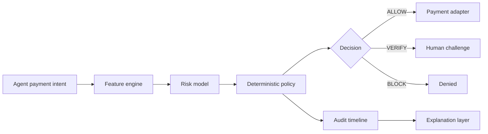

# AgentShield AI

[](https://github.com/iamshivam017/AgentShield-AI/actions/workflows/ci.yml)

**AI Risk & Trust Layer for Agentic Payments** — a defense-first submission for Razorpay Buildathon Track 02: AI Risk Manager.

AgentShield evaluates payments initiated by autonomous agents before money moves. It combines behavioral features, a calibrated anomaly model, deterministic policy enforcement, and explainable audit trails to return one of three decisions: `ALLOW`, `VERIFY`, or `BLOCK`.

Held-out synthetic benchmark: **94.78% precision · 85.83% recall · 90.08% F1 · 0.44% false-positive rate** at the cost-selected operating point. These are reproducible synthetic results, not claims about Razorpay customer data.

## Why it exists

Agentic commerce introduces a new loss class: an AI agent can make a technically valid payment that exceeds its mandate, targets an unfamiliar beneficiary, repeats too quickly, or deviates sharply from its owner's normal behavior. AgentShield protects that boundary without giving an LLM unrestricted control over money.

## Architecture



The policy engine is the final authority. ML and optional LLM explanations are advisory and cannot bypass user limits, verification requirements, or hard blocks.

## Repository layout

```text
apps/web/          Next.js operator dashboard
services/api/      FastAPI risk, policy, audit, and payment API
data/              Reproducible synthetic benchmark inputs
docs/              Architecture, threat model, runbooks, and submission notes
infra/             Deployment configuration
scripts/           Local automation and benchmark commands
```

## Local development

Prerequisites: Node.js 20+, Python 3.12+, and Docker Compose (recommended for PostgreSQL).

```bash
cp .env.example .env
make setup
make dev
```

The dashboard runs at <http://localhost:3000> and the API/OpenAPI UI at <http://localhost:8000/docs>.

The development email is `analyst@agentshield.dev`; set `DEMO_USER_PASSWORD`
locally before startup. No reusable password is stored in the repository, and
the account is never seeded in production.

## Quality gates

```bash
make lint
make typecheck
make test
make build
make benchmark
```

## Security defaults

- Deny-by-policy for malformed or out-of-mandate payment intents.
- Signed JWT access tokens with short expiry and role-based authorization.
- Idempotency enforcement, replay detection, input validation, and rate limiting.
- Append-only decision events with correlation IDs and explanation provenance.
- Secrets remain in environment variables; `.env` and model artifacts are ignored.
- Razorpay integration is restricted to test mode until explicitly configured.

See [docs/ARCHITECTURE.md](docs/ARCHITECTURE.md), [docs/SECURITY.md](docs/SECURITY.md), [docs/EVALUATION.md](docs/EVALUATION.md), and [docs/submission.md](docs/submission.md).

## Buildathon assets

- [Requirement traceability](docs/REQUIREMENT_TRACEABILITY.md)
- [Five-minute pitch](docs/PITCH_SCRIPT.md)
- [Demo runbook](docs/DEMO_SCRIPT.md)
- [Final production audit](docs/FINAL_AUDIT.md)

## License

MIT
