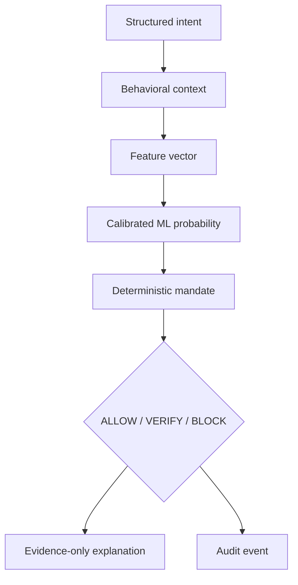

# AI system design

## Domain workflow

## Responsibilities

| Component | Input | Output | Authority |
|---|---|---|---|
| Feature engine | Intent + history + mandate | bounded numeric vector and evidence | None |
| ML model | Feature vector | probability and confidence | Advisory |
| Policy engine | Score + mandate + daily state | final decision and violations | Final risk authority |
| Explanation provider | final decision + trusted evidence | schema-validated summary | Presentation only |
| Human verifier | paused intent and evidence | approve or block | Required for `VERIFY` |
| Razorpay adapter | approved intent | test order or safe failure | Execution only after gate |

## Model strategy

The evaluation compares logistic regression, histogram gradient boosting, and Isolation Forest. Model selection uses validation PR-AUC. A future time window is held out for final threshold metrics. The runtime model is calibrated and versioned. Dataset generation uses a fixed seed and explicit behavioral drift.

## Guardrails

- Payment purpose and merchant text are treated as untrusted data, never instructions.
- The language-model prompt prohibits decision changes, execution proposals, and invented facts.
- Output must satisfy a minimal schema and strict length bound.
- Request timeout is four seconds; every provider or validation failure uses a deterministic explanation.
- No arbitrary tools are exposed to the language model.
- The policy decision is computed before explanation and cannot be modified afterward.
- Logs contain provider failure type, not secrets or input payloads.

## Anti-wrapper assessment

Removing the LLM leaves the product's core value intact: feature engineering, learned risk relationships, mandate enforcement, verification, Razorpay execution gating, auditability, and evaluation. The LLM improves comprehensibility but is deliberately non-critical. This is a risk system with an optional AI explanation layer—not a chat interface around payments.
