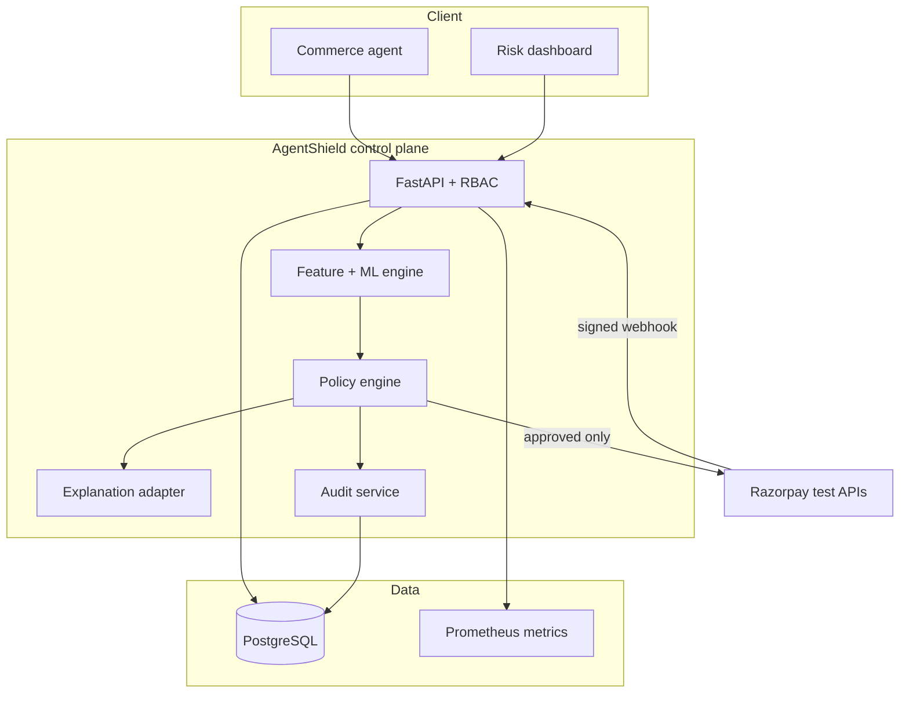
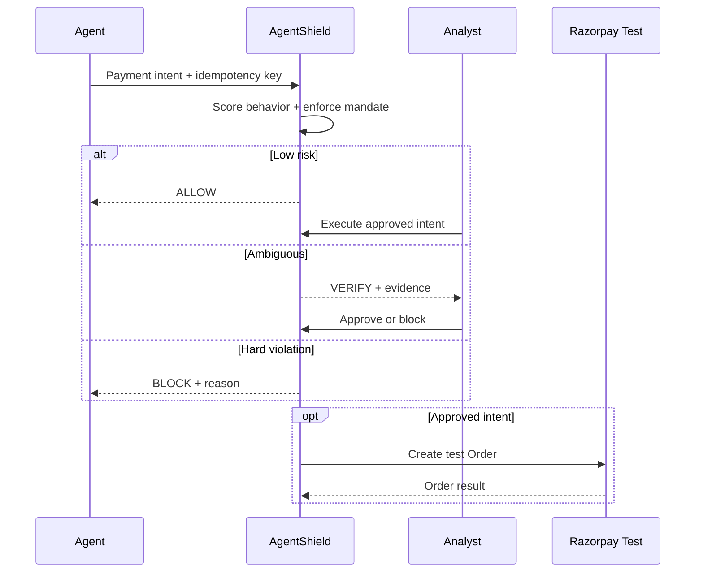
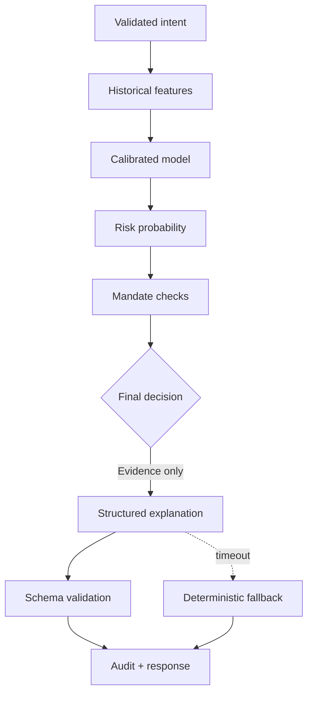
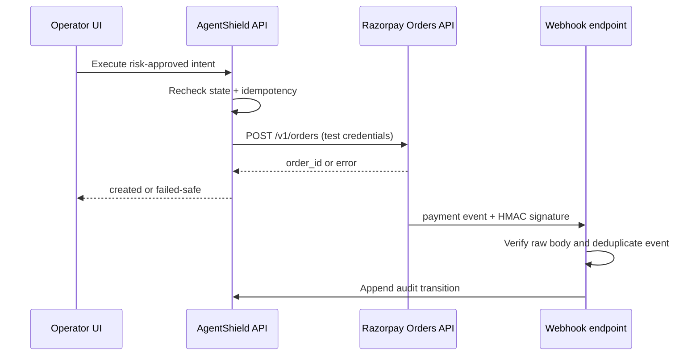
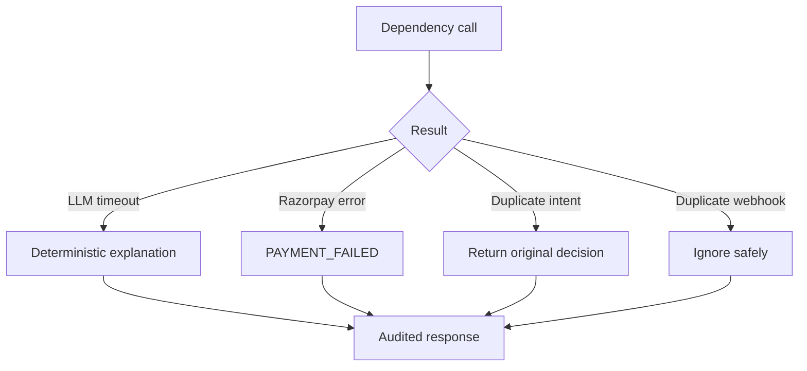

# AgentShield architecture

## System architecture

## Core user workflow

## AI decision workflow

## Razorpay event workflow

## Failure and recovery

## Deployment

Docker Compose runs a non-root Next.js container, a non-root FastAPI container, and PostgreSQL 16. The API exposes liveness, readiness, and Prometheus endpoints. A production deployment must terminate TLS, set a rotated JWT secret, configure exact CORS origins, run Alembic migrations before application rollout, and provide Razorpay test credentials through a secret store.

## State authority

- Clients never submit risk scores, decisions, payment status, or Razorpay identifiers.
- Payment amounts use integer paise throughout.
- `BLOCK` is terminal for a payment intent.
- `VERIFY` requires an authorized analyst transition.
- Razorpay calls only accept `APPROVED` state and record the returned order ID.
- Webhook state is accepted only after raw-body HMAC verification and event deduplication.
